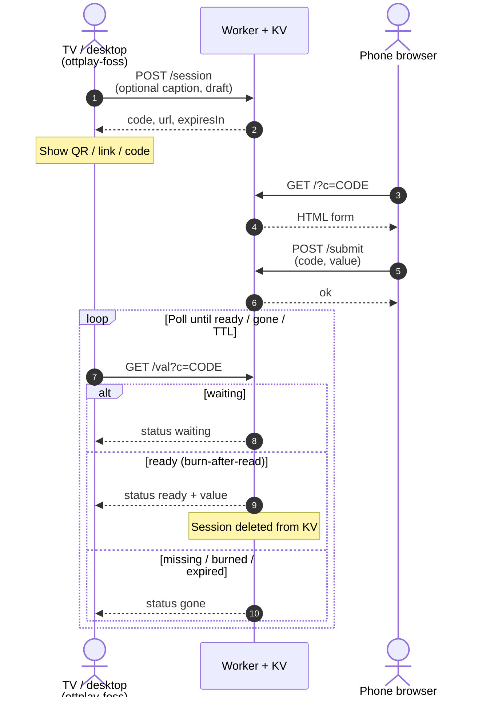

# ottplay-swop

Cloudflare Worker for one-time session handoff: desktop creates a short code, mobile fills a form, desktop polls and burns the value after read.

## How it works



## API

| Method | Path | Description |
|--------|------|-------------|
| POST | /session | Create session; optional caption and draft; returns code, url, expiresIn |
| GET | /?c=CODE | Mobile HTML form for the session |
| POST | /submit | Submit value (code, value); sets status ready |
| GET | /val?c=CODE | Poll waiting/ready/gone; burn-after-read on ready |
| GET | /health | ok true |

CORS enabled for GET, POST, OPTIONS.

## Setup

1. Copy example wrangler config to wrangler.toml; fill placeholders.
2. Install project dependencies.
3. Run local dev or deploy via package scripts.

wrangler.toml is gitignored and must never be committed with real credentials.

Note: no CF credentials in terraform; keep them outside .tf and state.

## Infrastructure (Terraform Cloud)

Durable Cloudflare resources (Workers KV namespace) are managed with Terraform Cloud.

- **Organization:** `victron-venus`
- **Workspace:** `ottplay-swop` — create in the TFC UI if it does not exist yet
- **Working directory:** `terraform`
- **Execution mode:** Remote
- **VCS:** optional — connect this GitHub repo in the TFC UI via the org OAuth app when available; until then use CLI-driven remote runs (same pattern as sibling workspaces)
- **VCS trigger patterns** (when connected): `terraform/**/*`
- **Workspace variables** (set in TFC, never in git):
  - `cloudflare_api_token` (sensitive) — Workers Scripts Edit + Workers KV Storage Edit/Read
  - `cloudflare_account_id` — Cloudflare account ID

```bash
terraform -chdir=terraform init
terraform -chdir=terraform plan
terraform -chdir=terraform apply
```

After apply:

1. Copy `kv_namespace_id` into local `wrangler.toml` (from `wrangler.toml.example`), or run `scripts/render-wrangler.sh`.
2. Deploy the Worker with wrangler/CI; then set `PUBLIC_BASE_URL` (or TFC/workspace `public_base_url`) to the workers.dev URL from the first deploy.

**Credentials never in git.** Root and `terraform/` gitignores exclude wrangler.toml, tfvars, `.env*`, `*.pem`/`*.key`, `credentials.json`, `credentials.tfrc.json`, and local Terraform state/plan files. Do not commit Cloudflare account IDs, API tokens, or KV IDs. The GitHub Terraform module (if any) is separate from this Cloudflare IaC.

Worker script upload stays with wrangler/CI (TypeScript must be bundled); Terraform owns the KV namespace id used in wrangler bindings.

## Scripts

- package script:dev -> wrangler-dev
- package script:deploy -> wrangler-deploy
- package script:tail -> wrangler-tail
- package script:cf-typegen -> wrangler-types
- `scripts/render-wrangler.sh` — fill `wrangler.toml` from `terraform output -raw kv_namespace_id`
