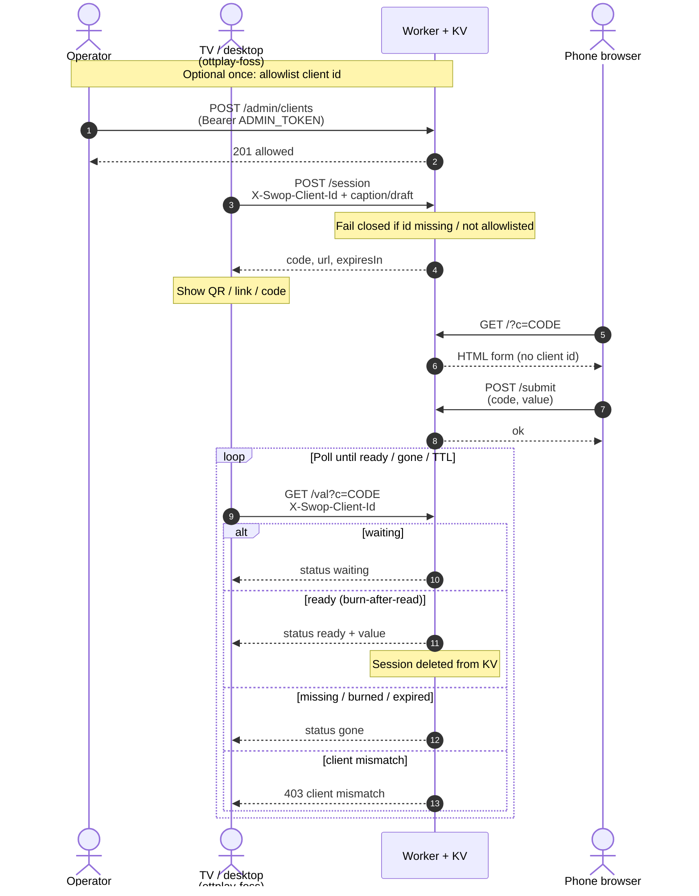

# ottplay-swop

Cloudflare Worker for one-time session handoff: desktop creates a short code, mobile fills a form, desktop polls and burns the value after read.

## How it works



## API

| Method | Path | Auth | Description |
|--------|------|------|-------------|
| POST | /session | allowlisted `X-Swop-Client-Id` | Create session; stores clientId; returns code, url, expiresIn |
| GET | /?c=CODE | none | Mobile HTML form for the session |
| POST | /submit | none | Submit value (code, value); sets status ready |
| GET | /val?c=CODE | allowlisted client id; must match session | Poll waiting/ready/gone; burn-after-read on ready |
| GET | /health | none | ok true |
| POST | /admin/clients | Bearer `ADMIN_TOKEN` | Allowlist a client id |
| DELETE | /admin/clients?id=… | Bearer `ADMIN_TOKEN` | Remove allowlist entry |
| GET | /admin/clients | Bearer `ADMIN_TOKEN` | List allowlisted client ids |

CORS enabled for GET, POST, DELETE, OPTIONS.

## Access control

Operator guide for keeping Cloudflare KV (and Worker invocations) limited to
**your** installs. Random FOSS downloads that point `swopBaseUrl` at your Worker
must not be able to create sessions or poll `/val`.

### Why

Anyone can download a FOSS ottplay binary and point it at our Worker. A shared
secret in the repo would not help: every downloader would have it. "Vasya
Pupkin" installs must not burn KV quota by creating sessions or polling `/val`.

The fix is an **allowlist**: only TVs/desktops whose stable client id is stored
in KV under `allow:{clientId}` can call protected routes. Phone browsers that
open the QR session URL do **not** send a client id and do not need one.

### Client id

Reuse the player **Device UUID** (`dev_…`):

- Shown in **About** / **Settings → Remote control**
- Stored in browser `localStorage` as `deviceId`
- Example shape: `dev_a1b2c3d4e5`

**Rules:** trim whitespace; length **8–128**; charset `[A-Za-z0-9._:-]`.

**Headers** (either name works):

- `X-Swop-Client-Id: <stable-id>`
- `X-Ottplay-Client-Id: <stable-id>` (alias)

### What is protected / not

See the [API](#api) table above. Summary:

| Kind | Routes |
|------|--------|
| **Protected** (allowlisted client id) | `POST /session`, `GET /val` |
| **Unprotected** (by design) | `GET /?c=`, `POST /submit`, `GET /health`, `OPTIONS` |
| **Admin** (Bearer ADMIN_TOKEN) | `/admin/clients*` |

If ADMIN_TOKEN is unset, admin routes return **503** and client routes still
**fail closed** (nobody is allowlisted until you configure the token and add ids).

**Errors:** missing/invalid id -> 401 missing client id; not allowlisted -> 403 client not allowed; /val mismatch -> 403 client mismatch.

### Admin setup (exact steps)

1. Set the admin secret (never put it in `[vars]` or commit it):

   ```bash
   wrangler secret put ADMIN_TOKEN
   ```

2. Deploy the Worker (npm run deploy / CI).

3. Set your base URL (workers.dev or custom domain):

   ```bash
   BASE=https://ottplay-swop.<account>.workers.dev
   ```

4. Allowlist / list / revoke clients (optional note field for humans):

   ```bash
   # Allowlist
   curl -X POST "$BASE/admin/clients" \
     -H "Authorization: Bearer $ADMIN_TOKEN" \
     -H "Content-Type: application/json" \
     -d '{"clientId":"dev_a1b2c3d4e5","note":"living-room"}'

   # List
   curl -H "Authorization: Bearer $ADMIN_TOKEN" "$BASE/admin/clients"

   # Revoke
   curl -X DELETE -H "Authorization: Bearer $ADMIN_TOKEN" \
     "$BASE/admin/clients?id=dev_a1b2c3d4e5"
   ```

### Manual authorize flow

1. Open the player on the TV/desktop.
2. Copy Device ID from About / Settings → Remote control (or localStorage.deviceId).
3. Run the POST admin/clients example above with that id.
4. Confirm the player sends X-Swop-Client-Id (or alias) on /session and /val, and swopBaseUrl points at your Worker.

### Can `deploy.sh` auto-add clients?

**Today:** `ottplay-foss/deploy.sh` only pulls/runs Docker. It does **not** know
a browser `deviceId` — that id is created on first player load in
`localStorage`, after the container is already up. So the current script cannot
auto-allowlist.

**Yes, we can extend it** for *our* operator installs (optional path, not
default):

| Piece | Notes |
|-------|--------|
| Env on deploy host | `SWOP_BASE_URL`, `SWOP_ADMIN_TOKEN` (secret on the host only — **never** in the image or git), optional `SWOP_CLIENT_ID` |
| If `SWOP_CLIENT_ID` unset | Generate once (`dev_<hex>` UUID) and persist next to the container (host file / volume) |
| After container is up | `curl -X POST "$SWOP_BASE_URL/admin/clients" -H "Authorization: Bearer $SWOP_ADMIN_TOKEN" …` |
| Inject the same id | Future: docker env / settings bootstrap / server-injected config so the player sends that header |

Until the foss client is wired to send the header and use `swopBaseUrl`,
auto-allow alone is **not** enough.

**Public Docker Hub image** must **not** ship `ADMIN_TOKEN` or a pre-allowlisted
id.

### Future foss work (checklist)

- [ ] Generate/persist Device UUID (already exists as `deviceId`)
- [ ] Setting `swopBaseUrl` (empty = remote text entry disabled)
- [ ] ♥™ / remote VKB: `POST /session` + poll `GET /val` with
      `X-Swop-Client-Id` (or alias)
- [ ] Hide key / entry UI when base URL is empty
- [ ] Link player docs to this repo's Access control section

Client wiring lives in [ottplay-foss](https://github.com/open-ott-play/ottplay-foss);
this Worker PR only ships the allowlist API.

## Setup

1. Copy example wrangler config to wrangler.toml; fill placeholders.
2. Install project dependencies.
3. Run local dev or deploy via package scripts.

wrangler.toml is gitignored and must never be committed with real credentials.

Note: no CF credentials in terraform; keep them outside .tf and state.

## Infrastructure (Terraform Cloud)

Durable Cloudflare resources (Workers KV namespace) are managed with Terraform Cloud.

- **Organization:** `open-ott-play`
- **Workspace:** `ottplay-swop` — create in the TFC UI if it does not exist yet
- **Working directory:** `terraform`
- **Execution mode:** Remote
- **VCS:** optional — connect this GitHub repo in the TFC UI via the org OAuth app when available; until then use CLI-driven remote runs (same pattern as sibling workspaces)
- **VCS trigger patterns** (when connected): `terraform/**/*`
- **Credentials** (same names as `~/1/1/home/cloudflare/rules_lists`; never commit):
  - `account_xyz` — Cloudflare Account ID
  - `email_xyz` — Cloudflare login email
  - `key_xyz` (sensitive) — Cloudflare Global API Key
  - Local CLI: export `TF_VAR_account_xyz` / `TF_VAR_email_xyz` / `TF_VAR_key_xyz` (e.g. from bashrc) so `terraform` picks them up automatically
  - TFC remote runs: set the same three names as workspace variables (`key_xyz` sensitive); bashrc `TF_VAR_*` does not apply inside TFC

```bash
cd terraform
terraform init
terraform plan
terraform apply
```

After apply:

1. Copy `kv_namespace_id` into local `wrangler.toml` (from `wrangler.toml.example`), or run `scripts/render-wrangler.sh`.
2. Deploy the Worker with wrangler/CI; then set `PUBLIC_BASE_URL` (or TFC/workspace `public_base_url`) to the workers.dev URL from the first deploy.

**Credentials never in git.** Root and `terraform/` gitignores exclude wrangler.toml, tfvars, `.env*`, `*.pem`/`*.key`, `credentials.json`, `credentials.tfrc.json`, and local Terraform state/plan files. Do not commit Cloudflare account IDs, API tokens, or KV IDs. The GitHub Terraform module (if any) is separate from this Cloudflare IaC.

Worker script upload stays with wrangler/CI (TypeScript must be bundled); Terraform owns the KV namespace id used in wrangler bindings.

## Scripts

- package script:dev -> wrangler-dev
- package script:deploy -> wrangler-deploy
- package script:tail -> wrangler-tail
- package script:cf-typegen -> wrangler-types
- `scripts/render-wrangler.sh` — fill `wrangler.toml` from terraform outputs (run from **repo root**; script resolves paths relative to itself)
