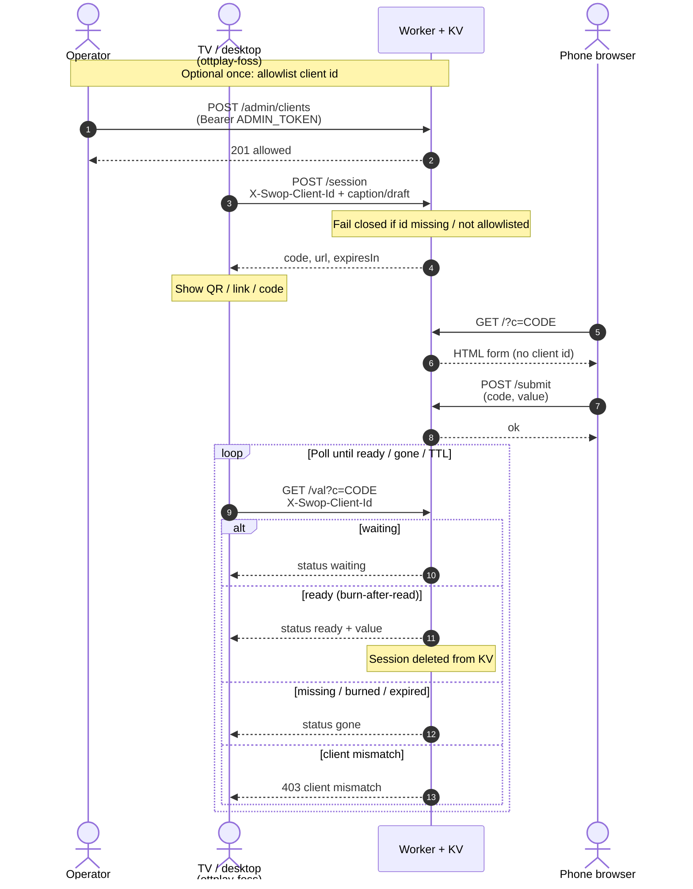

# ottplay-swop

Cloudflare Worker for one-time session handoff: desktop creates a short code, mobile fills a form, desktop polls and burns the value after read.

## How it works



## API

| Method | Path | Auth | Description |
|--------|------|------|-------------|
| POST | /session | allowlisted `X-Swop-Client-Id` | Create session; stores clientId; returns code, url, expiresIn |
| GET | /?c=CODE | none | Mobile HTML form for the session |
| POST | /submit | none | Submit value (code, value); sets status ready |
| GET | /val?c=CODE | allowlisted client id; must match session | Poll waiting/ready/gone; burn-after-read on ready |
| GET | /health | none | ok true |
| POST | /admin/clients | Bearer `ADMIN_TOKEN` | Allowlist a client id |
| DELETE | /admin/clients?id=… | Bearer `ADMIN_TOKEN` | Remove allowlist entry |
| GET | /admin/clients | Bearer `ADMIN_TOKEN` | List allowlisted client ids |

CORS enabled for GET, POST, DELETE, OPTIONS.

## Access control

Anyone can download a FOSS ottplay binary that points `swopBaseUrl` at your Worker. A shared secret in the repo would not help: every downloader would have it. Random “Vasya Pupkin” installs must not be able to create sessions or poll `/val` and burn Cloudflare KV.

**Allowlist:** only TVs/desktops whose stable client id is stored in KV under `allow:{clientId}` can call protected routes. Phone browsers that open the QR session URL do **not** send a client id and do not need one (`GET /?c=`, `POST /submit`).

**Protected:** `POST /session`, `GET /val`  
**Unprotected (by design):** `GET /?c=`, `POST /submit`, `GET /health`, `OPTIONS`  
**Admin:** `/admin/clients*` — Bearer `ADMIN_TOKEN` (Wrangler secret). If `ADMIN_TOKEN` is unset, admin routes return 503 and client routes still fail closed (nobody is allowlisted until you configure the token and add ids).

Header: `X-Swop-Client-Id: <stable-id>` (alias `X-Ottplay-Client-Id`). Id rules: trim, length 8–128, charset `[A-Za-z0-9._:-]`.

Errors: missing/invalid id → `401 {"error":"missing client id"}`; not allowlisted → `403 {"error":"client not allowed"}`; `/val` with a different id than the session → `403 {"error":"client mismatch"}`.

### Configure admin token

```bash
wrangler secret put ADMIN_TOKEN
```

Do not put `ADMIN_TOKEN` in `[vars]` or commit it.

### Authorize a player

1. Get the device id from the player About screen / localStorage `deviceId` (or a future settings UI).
2. Allowlist it:

```bash
curl -X POST "$BASE/admin/clients" \
  -H "Authorization: Bearer $ADMIN_TOKEN" \
  -H "Content-Type: application/json" \
  -d '{"clientId":"...","note":"living-room"}'
```

List / revoke:

```bash
curl -H "Authorization: Bearer $ADMIN_TOKEN" "$BASE/admin/clients"
curl -X DELETE -H "Authorization: Bearer $ADMIN_TOKEN" "$BASE/admin/clients?id=..."
```

**Future ottplay-foss:** send `X-Swop-Client-Id` on `/session` and `/val` (not implemented in this Worker PR).

## Setup

1. Copy example wrangler config to wrangler.toml; fill placeholders.
2. Install project dependencies.
3. Run local dev or deploy via package scripts.

wrangler.toml is gitignored and must never be committed with real credentials.

Note: no CF credentials in terraform; keep them outside .tf and state.

## Infrastructure (Terraform Cloud)

Durable Cloudflare resources (Workers KV namespace) are managed with Terraform Cloud.

- **Organization:** `victron-venus`
- **Workspace:** `ottplay-swop` — create in the TFC UI if it does not exist yet
- **Working directory:** `terraform`
- **Execution mode:** Remote
- **VCS:** optional — connect this GitHub repo in the TFC UI via the org OAuth app when available; until then use CLI-driven remote runs (same pattern as sibling workspaces)
- **VCS trigger patterns** (when connected): `terraform/**/*`
- **Workspace variables** (set in TFC, never in git):
  - `cloudflare_api_token` (sensitive) — Workers Scripts Edit + Workers KV Storage Edit/Read
  - `cloudflare_account_id` — Cloudflare account ID

```bash
terraform -chdir=terraform init
terraform -chdir=terraform plan
terraform -chdir=terraform apply
```

After apply:

1. Copy `kv_namespace_id` into local `wrangler.toml` (from `wrangler.toml.example`), or run `scripts/render-wrangler.sh`.
2. Deploy the Worker with wrangler/CI; then set `PUBLIC_BASE_URL` (or TFC/workspace `public_base_url`) to the workers.dev URL from the first deploy.

**Credentials never in git.** Root and `terraform/` gitignores exclude wrangler.toml, tfvars, `.env*`, `*.pem`/`*.key`, `credentials.json`, `credentials.tfrc.json`, and local Terraform state/plan files. Do not commit Cloudflare account IDs, API tokens, or KV IDs. The GitHub Terraform module (if any) is separate from this Cloudflare IaC.

Worker script upload stays with wrangler/CI (TypeScript must be bundled); Terraform owns the KV namespace id used in wrangler bindings.

## Scripts

- package script:dev -> wrangler-dev
- package script:deploy -> wrangler-deploy
- package script:tail -> wrangler-tail
- package script:cf-typegen -> wrangler-types
- `scripts/render-wrangler.sh` — fill `wrangler.toml` from `terraform output -raw kv_namespace_id`
